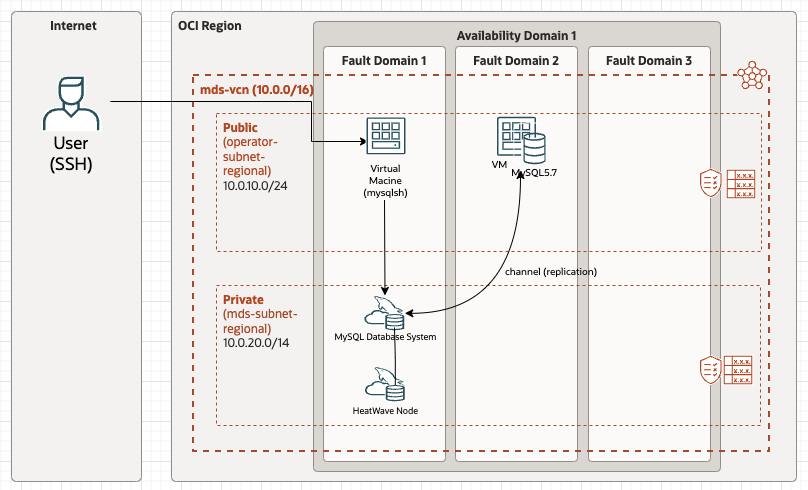

# 1. 전체 MDS 구성도    
OCI에 있는 MDS, HeatWave, Replication 테스트를 하기 위해 아래와 같이 구성하여 테스트 진행    
Source(MySQL 5.7)를 제외하고는 아래 Delpoy를 아이콘을 클릭하여 설치를 진행하면 자동으로 구성을 진행함      
[](https://cloud.oracle.com/resourcemanager/stacks/create?zipUrl=https://github.com/khkwon01/terraform-mds/archive/refs/tags/mds-heatwave-v3.3.0.zip)   



# 2. Source 구성 (MySQL 5.7)  
위에 그림에서 MySQL 5.7에 해당 하는 부분은 직접 VM 인스턴스를 생성하여 MySQL 설치하여 구성함

## 1) VM 구성    
Name과 Oracle Linux8 os, operator-subnet-regional subnet등을 선택하여 설치

기본적으로 firewall은 disable 시켜야 함.    
```
systemctl stop firewalld.service 
systemctl disable firewalld.service 
```
## 2) MySQL 5.7 Download    
wget https://dev.mysql.com/get/Downloads/MySQL-5.7/mysql-5.7.42-linux-glibc2.12-x86_64.tar

## 3) MySQL 추가 패키지 설치   
yum install -y ncurses-compat-libs

## 4) MySQL 5.7 설치
```
tar -xvf mysql-5.7.42-linux-glibc2.12-x86_64.tar.gz
mv mysql-5.7.42-linux-glibc2.12-x86_64 /usr/local/mysql

groupadd mysql
useradd -r -g mysql -s /bin/false mysql
cd /usr/local/mysql
mkdir mysql-files
chown mysql:mysql mysql-files
chmod 750 mysql-files
bin/mysqld --initialize --user=mysql
bin/mysql_ssl_rsa_setup
bin/mysqld_safe --user=mysql &
// 가동 후 임시 패스워드 변경  set password = password('Welcome#1')
echo "export PATH=$PATH:/usr/local/mysql/bin" >> /root/.bash_profile
. ~/.bash_profile
set password=password('Welcome#1');
cp support-files/mysql.server /etc/init.d/mysql.server

printf "[mysqld]\ngtid_mode=on\nenforce-gtid-consistency\nlog-bin=/usr/local/mysql/data/logbin\nserver_id=0720\n" >> /etc/my.cnf
/etc/init.d/mysql.server restart
```
## 5) Test 계정 생성 및 데이터 import
```
// 샘플 데이터 다운로드
wget https://downloads.mysql.com/docs/world-db.zip

// 샘플 데이터 import
mysql -u root -p < world.sql

// 테스트 계정 생성
mysql> create user svctest@'%' identified by "Welcome#1";
mysql> grant all privileges on world.* to svctest@'%';

// replication 계정 생성
mysql> create user repl@'%' identified by "Welcome#1";
mysql> grant replication slave on *.* to repl@'%';
```
# 3. Target 구성 (MDS, HeatWave)
## 1) 초기 데이터 적재
```
// 샘플 데이터 import
mysql -u admin -h <<mds or heatwave ip>> -p < world.sql
```
## 2) channel - replication ( 메뉴 Databases > DB systems > channels ) 
### A. Source connection (공통)   
아래 항목은 channel 구성(전체, 스키마, db, table등)시 기본 공통적으로 설정을 해야 하는 부분임.     


### B. Target DB system - 전체
Source와 Target db간 전체 데이터가 동일해야 함   
(channel filter 참고 자료 : https://docs.oracle.com/en-us/iaas/mysql-database/doc/creating-replication-channel.html#GUID-DF828619-669E-41CC-8BE5-F7A136AFF470)    
- replication 구성 
  

- replication 완료후 상태   
  

- replication 테스트
  - Source DDL/DML 수행   
    ```
    // source에서 아래와 같이 수행하면 target에서 생성
    create database test1;
    user test1;
    create table t1 (id int primary key, nm varchar(10));
    insert into t1 values (1, 'nm1'), (2, 'nm2'), (3, 'nm3');
  
    // target에서 아래 명령어를 수행하면 복제된 걸 확인 가능
    ```
  - Target 조회 결과    
    
   
### C. Target DB system - db   
Source와 Target db간 schema 기준 데이터가 동일해야 함
- replication 구성
      
  

- replication 완료후 상태    
  

- replication 테스트
  - Source DDL/DML 수행   
    ```
    use world;
    create table t1 (id int primary key, nm varchar(10));
    insert into t1 values (1, 'nm1'), (2, 'nm2'), (3, 'nm3');
    update t1 set nm = 'changenm2' where id = 2;
    ```
  - Target 조회 결과    
    

### D. Target DB system - table-*    
Source와 Target db간 테이블 기준 데이터가 동일해야 함    
- replication 구성
  
  

- replication 완료후 상태    
  

- replication 테스트
  - Source DDL/DML 수행   
    ```
    use world;
    insert into t1 values (4, 'nm4'), (5, 'nm5'), (6, 'nm6');
    update t1 set nm = 'changenm5' where id = 5;
    create table t2 (id int primary key, nm varchar(10));
    insert into t2 values (1, 'nm1'), (2, 'nm2'), (3, 'nm3');
    ```
  - Target 조회 결과     
    
  
  - 추가 테스트    
    - 1개 정책에 여러개 table 이름 패턴 추가 - 지원안됨     
           
    - 여러개 정책에 table 이름 패턴 추가 - 지원     
          

### E. Target DB system - rewrite-db 
Source와 Target db간 db 이름만 다르고 데이터는 동일해야 함
- replication 구성
  

- replication 완료후 상태      
  

- replication 테스트
  - Source DDL/DML 수행   
    ```
    use world;
    update city set name='Kabul_change' where id = 1;    
    create table t1 (id int primary key, nm varchar(10));
    insert into t1 values (1, 'nm1'), (2, 'nm2'), (3, 'nm3');    
    ```
  - Target 조회 결과     
     
    


